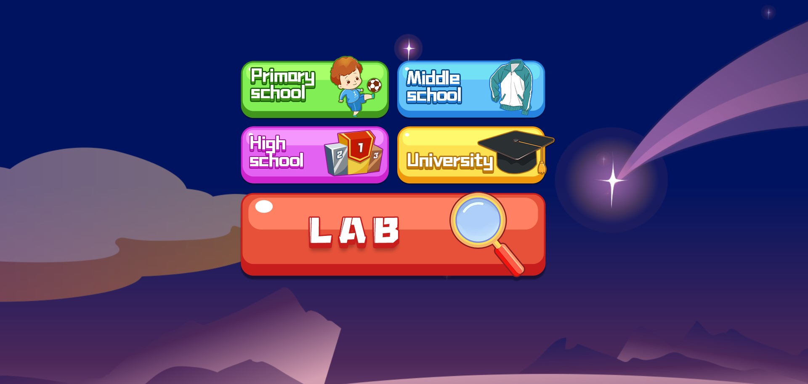
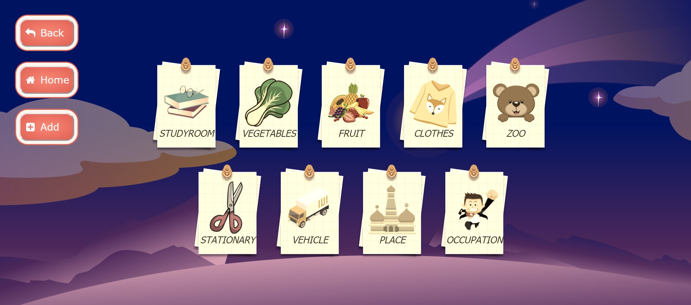
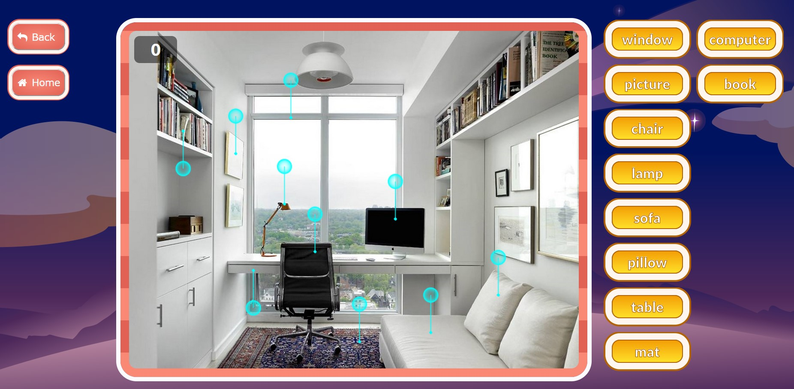
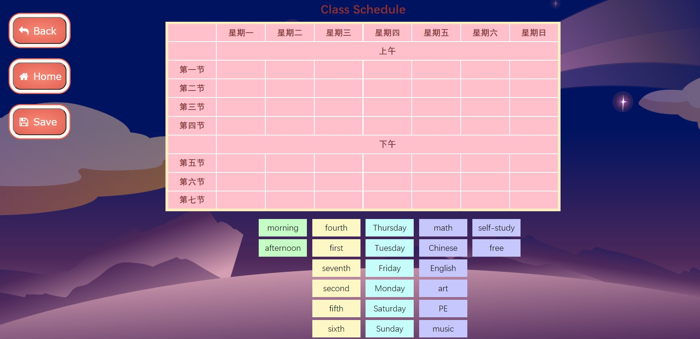
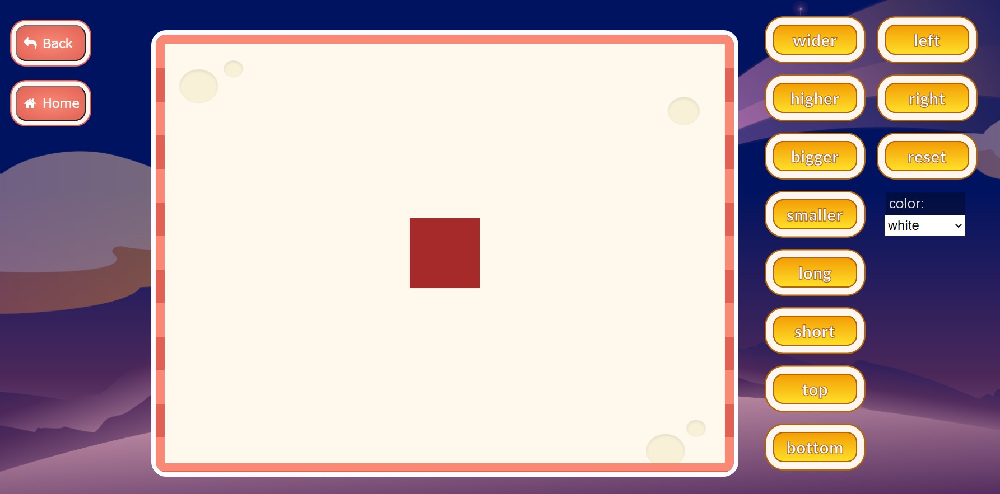
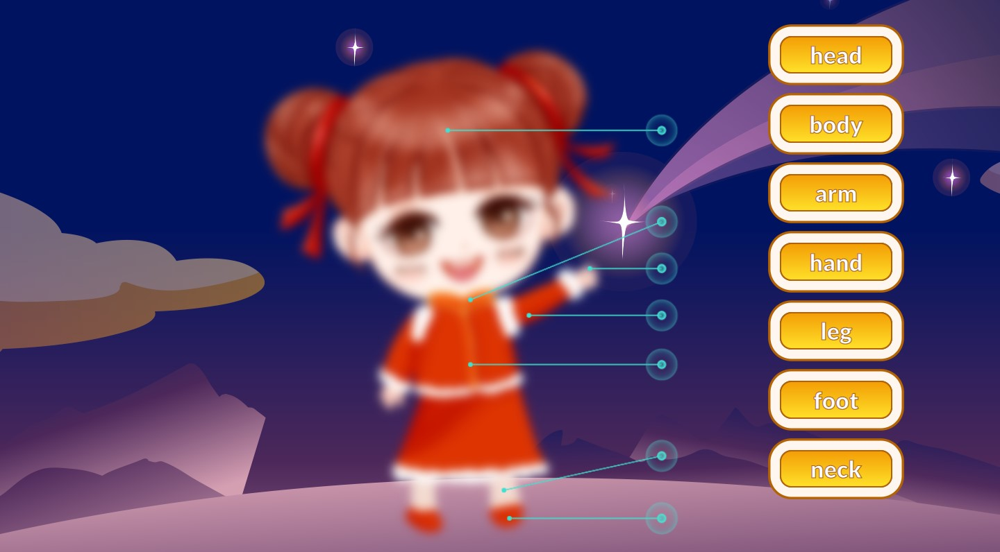

# happy words

## 简介

这是由我独立开发的第一款 Web App，也可以算是我的启蒙老师，帮助我在实践中巩固了前端三件套的基本语法，带我进入了前端的世界。该软件的特点是场景化记忆和交互记忆，将抽象的单词和具象的场景联系起来，帮助学生更高效的理解和记忆单词，这也是软件设计的初衷。想要尝试的同学可以进入我的[个人主页](http://super-xman.github.io)挑战一下。

## 界面
目前软件只涉及到小学课程的部分单词，因此只有 primary school 和 lab 模块是可用的。从index可以进入图1界面。

## 场景
该软件设计了9个场景，场景中记录了物品的位置，拖动单词标签到正确位置即可得分，若匹配错误，下次得分会递减。软件还支持自定义场景，用户可以自己上传图片，标注单词和在场景中的对应位置。

## 趣味游戏

### 课程表
拖拽元素到正确位置则会“粘贴”到课程表上，课程单词能重复使用，学生可以创建属于自己的课程表。

### 方块操作
按钮调整方块的尺寸位置颜色等，帮助学生学习几何特征相关的形容词。

### 角色选择
从 start.html 进入，是学生进入软件遇到的第一个游戏，将所有器官匹配正确才能完成角色选择，完成后进入的主界面，正式开始 happy words。

## 不足
当初的设想是做一款涵盖中小学常用单词的软件。但最终由于时间问题，只做出了设想中的一部分功能。当时也没考虑到适配不同窗口大小，更没有考虑做成响应式页面，是一个遗憾，有空会继续进行完善，目前仅建议在桌面端浏览器访问和操作。
